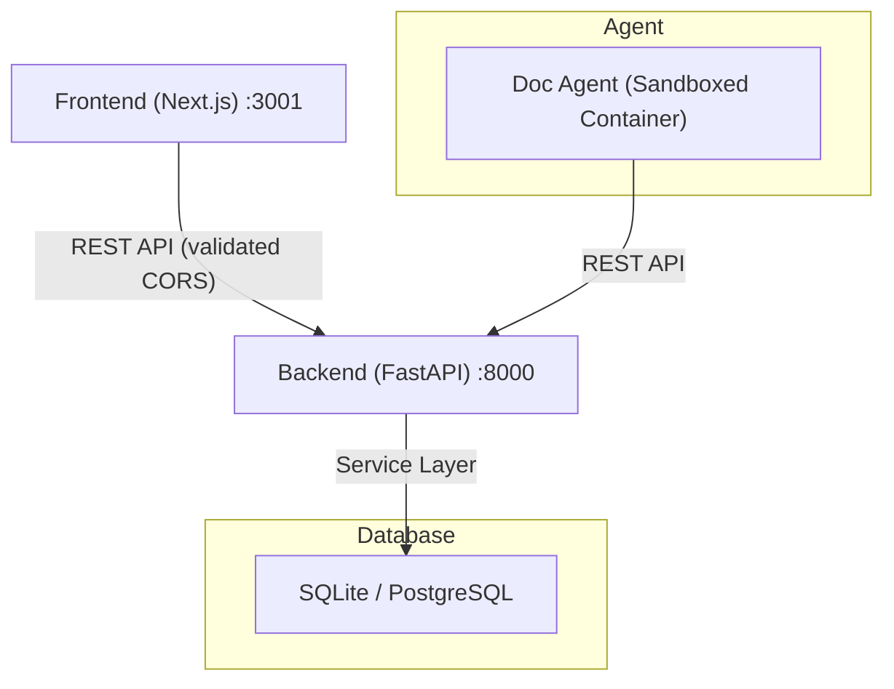

# IsoCrates Architecture

## System Overview

IsoCrates is an AI-powered technical documentation platform built around three cooperating layers. The **Frontend** (Next.js 14) provides the user-facing experience: a document viewer, tree navigation, CMD+K search, and version history. Behind it sits the **Backend** (FastAPI + SQLite), which exposes a REST API organized into deep module services with structured error handling and configuration validation. Finally, the **Agent** (OpenHands SDK in Docker) acts as an autonomous documentation generator, hardened against prompt injection and running inside a sandboxed container.

Because the frontend and backend communicate exclusively through a validated CORS-enabled REST API, each layer can evolve independently. The backend's service layer encapsulates all business logic so that API endpoints remain thin, and the SQLite database stores documents, versions, dependencies, folder metadata, users, and the personal organization tables. The agent, in turn, connects to the same REST API from within its sandboxed Docker environment, using security validators and the OpenHands SDK to generate documentation safely.



---

## Data Model

### documents
```sql
id              TEXT PRIMARY KEY          -- doc-{hash}-{type} or doc-standalone-{hash}
repo_url        TEXT                      -- Nullable (for standalone docs)
repo_name       VARCHAR(255)              -- Nullable
path            VARCHAR(500) NOT NULL     -- Full path (first segment = crate)
doc_type        TEXT NOT NULL             -- client, softdev, etc. (legacy, retained)
title           TEXT NOT NULL
content         TEXT
created_at      TIMESTAMP DEFAULT CURRENT_TIMESTAMP
updated_at      TIMESTAMP DEFAULT CURRENT_TIMESTAMP
generation_count INTEGER DEFAULT 0
description     TEXT                      -- 2-3 sentence summary for search/embeddings
is_indexed      BOOLEAN DEFAULT FALSE     -- True if embedding has been generated
keywords        JSON                      -- Optional keyword tags
deleted_at      TIMESTAMP                 -- Soft delete timestamp (NULL = active)
```

### versions
```sql
id              INTEGER PRIMARY KEY
doc_id          TEXT NOT NULL             -- FK to documents.id (CASCADE)
content         TEXT
author_type     TEXT NOT NULL             -- "ai" or "human"
author_metadata JSON                      -- Contains repo_commit_sha, etc.
created_at      TIMESTAMP DEFAULT CURRENT_TIMESTAMP
```

### dependencies
```sql
id              INTEGER PRIMARY KEY
source_doc_id   TEXT NOT NULL             -- Document containing the [[wikilink]]
target_doc_id   TEXT NOT NULL             -- Document being linked to
link_text       TEXT                      -- The wikilink text
created_at      TIMESTAMP DEFAULT CURRENT_TIMESTAMP
UNIQUE(source_doc_id, target_doc_id)
```

### folder_metadata
```sql
id              VARCHAR(50) PRIMARY KEY
path            VARCHAR(500) NOT NULL UNIQUE  -- First segment = crate
description     TEXT
icon            VARCHAR(50)
sort_order      INTEGER DEFAULT 0
created_at      TIMESTAMP DEFAULT CURRENT_TIMESTAMP
updated_at      TIMESTAMP DEFAULT CURRENT_TIMESTAMP
```

### users
```sql
user_id         TEXT PRIMARY KEY         -- UUID prefix (8 chars)
display_name    TEXT NOT NULL
email           TEXT UNIQUE              -- Login credential
password_hash   TEXT                     -- bcrypt via passlib
role            TEXT NOT NULL DEFAULT 'viewer'  -- admin, editor, viewer
is_active       BOOLEAN NOT NULL DEFAULT true
created_at      TIMESTAMP DEFAULT CURRENT_TIMESTAMP
```

### folder_grants
```sql
user_id         TEXT NOT NULL            -- FK to users.user_id (CASCADE)
path_prefix     TEXT NOT NULL DEFAULT '' -- '' = root (all docs). Longest match wins.
role            TEXT NOT NULL DEFAULT 'viewer'  -- Overrides user.role for this subtree
granted_by      TEXT                     -- FK to users.user_id (who granted this)
created_at      TIMESTAMP DEFAULT CURRENT_TIMESTAMP
PRIMARY KEY (user_id, path_prefix)
```

### audit_log
```sql
id              INTEGER PRIMARY KEY AUTOINCREMENT
user_id         TEXT                     -- FK to users.user_id
action          TEXT NOT NULL            -- create, update, delete, login, role_change, grant_create, grant_revoke
resource_type   TEXT NOT NULL            -- document, user, folder, grant
resource_id     TEXT
details         TEXT                     -- JSON string with additional context
ip_address      TEXT
created_at      TIMESTAMP DEFAULT CURRENT_TIMESTAMP
```

### personal_folders
```sql
folder_id       TEXT PRIMARY KEY         -- pf-{hash}
user_id         TEXT NOT NULL            -- FK to users.user_id
name            TEXT NOT NULL
parent_id       TEXT                     -- FK to personal_folders.folder_id (CASCADE)
sort_order      INTEGER DEFAULT 0
created_at      TIMESTAMP DEFAULT CURRENT_TIMESTAMP
UNIQUE(user_id, parent_id, name)
```

### personal_document_refs
```sql
ref_id          TEXT PRIMARY KEY         -- pr-{hash}
user_id         TEXT NOT NULL            -- FK to users.user_id
folder_id       TEXT NOT NULL            -- FK to personal_folders.folder_id (CASCADE)
document_id     TEXT NOT NULL            -- FK to documents.id (CASCADE)
sort_order      INTEGER DEFAULT 0
created_at      TIMESTAMP DEFAULT CURRENT_TIMESTAMP
UNIQUE(user_id, folder_id, document_id)
```

### Relationships

Documents have a `path` field where the first segment is the "crate" (top-level category). Document IDs are generated from `repo_url + path + title` for hierarchical documents or from `repo_url + doc_type` for legacy documents. When creating a nested folder such as `a/b/c`, the system automatically creates metadata records for all ancestors (`a` and `a/b`), which means callers never need to worry about intermediate paths. The personal tree uses references rather than copies, so deleting a document cascades to its personal refs throughout the system.

---

## Service Layer

### DocumentService (Deep Module)

DocumentService orchestrates all document operations behind a simple interface. The guiding principle is that endpoints should be 5-15 lines long, because all complexity lives inside the service rather than leaking into the route handlers. This means a bloated endpoint that previously handled querying, validation, versioning, and dependency extraction collapses into a single service call.

**Before (shallow):**
```python
@router.put("/api/docs/{doc_id}")
def update_document(doc_id, data, db):
    doc = db.query(Document).filter_by(id=doc_id).first()
    if not doc: raise HTTPException(404)
    doc.content = data.content
    version = Version(...)
    db.add(version)
    dep_service.replace_document_dependencies(doc_id, data.content)
    db.commit()
    return doc
```

**After (deep):**
```python
@router.put("/api/docs/{doc_id}")
def update_document(doc_id, data, db):
    return document_service.update_document(db, doc_id, data)
```

The public interface exposes `create_or_update_document()` for upserting with version tracking and dependency extraction, along with `update_document()` for updates that automatically create new versions. Standard retrieval and lifecycle methods include `get_document()`, `list_documents()`, and `delete_document()`. For organizational changes there is `move_document()`, which relocates a document to a different folder path. Metadata-specific updates are handled by `update_keywords()` and `update_repo_url()`. The service also provides `search_documents()` for full-text search and `resolve_wikilink()` for cross-reference resolution, which delegates internally to DependencyService.

### FolderService (Deep Module)

FolderService is a single class that handles all folder and tree operations. All path validation, ancestor creation, and tree construction are private internals, which means the public surface stays small: `create_folder`, `delete_folder`, `move_folder`, `get_tree`, `update_folder`, `get_folder`, `list_folders`, and `cleanup_orphans`.

Several key behaviors define how the service works in practice. Creating folder `a/b/c` automatically creates the ancestors `a` and `a/b`, so callers never need to build parent paths manually. Deletion supports two modes: `move_up` re-parents the folder's contents to its parent, while `delete_all` removes the folder and everything inside it. Tree building produces a 2-level hierarchy and marks top-level folders with `is_crate=True` so the frontend can render them distinctly.

### DependencyService (Deep Module)

DependencyService manages all document-to-document relationships. The `create_dependency()` method validates that both documents exist, prevents self-links, and detects circular dependencies using depth-first search before performing an idempotent creation. The `replace_document_dependencies()` method extracts wikilinks from document content, resolves targets, and recreates all outgoing dependencies; DocumentService calls this automatically on every save. Finally, `get_all_dependencies()` returns the full dependency graph, which the frontend uses for visualization.

### PersonalTreeService

PersonalTreeService provides per-user document organization using references rather than copies. It manages personal folders and document refs stored in the `personal_*` tables, so each user can organize documents into their own hierarchy without duplicating content.

### Repository Pattern

All data access goes through repository classes (`DocumentRepository`, `FolderRepository`, `VersionRepository`, `DependencyRepository`). Services never touch the ORM directly, which means the persistence layer can be swapped or tested independently.

### Exception Hierarchy

```python
class DocumentNotFoundError(BaseException):
    error_code = "DOCUMENT_NOT_FOUND"

class CircularDependencyError(BaseException):
    error_code = "CIRCULAR_DEPENDENCY"

class InvalidInputError(BaseException):
    error_code = "INVALID_INPUT"

class AuthenticationError(BaseException):
    error_code = "UNAUTHORIZED"      # status 401

class ForbiddenError(BaseException):
    error_code = "FORBIDDEN"         # status 403
```

Error responses follow a consistent structure:
```json
{
  "error": "DOCUMENT_NOT_FOUND",
  "message": "Document not found: doc-abc123",
  "details": {"doc_id": "doc-abc123"}
}
```

Middleware catches all custom exceptions and converts them to structured JSON responses. As a result, the frontend can rely on a predictable error shape and displays problems as toast notifications rather than using `alert()`.

### Authentication & Permission System

The authentication system is built around three FastAPI dependencies defined in **`backend/app/core/auth.py`**:

```python
require_auth(credentials, db) -> AuthContext   # 401 if invalid; anonymous admin if AUTH_ENABLED=False
optional_auth(credentials, db) -> AuthContext  # Always returns a context, never None
require_admin(auth) -> AuthContext             # 403 if not admin role
```

`AuthContext` is a frozen dataclass containing `user_id`, `role`, and `grants` (a list of FolderGrant objects loaded from the database). The behavior of these dependencies varies by environment. When `AUTH_ENABLED=false`, both `require_auth` and `optional_auth` return an anonymous admin context with a root grant that provides full access; this is a development convenience that eliminates the need for tokens. When `AUTH_ENABLED=true` and the request carries a valid token, the system returns the user's context with their grants loaded from the database. When `AUTH_ENABLED=true` but the request has no token or an invalid token, `require_auth` raises a 401 error, while `optional_auth` returns an `_UNAUTHENTICATED` context with empty grants. Because permission checks still run against those empty grants, unauthenticated requests are denied everything; this design ensures they never bypass permission filtering.

Token management lives in **`backend/app/core/token_factory.py`**, which provides two pure functions for JWT handling:

```python
create_token(subject, role, secret, algorithm="HS256", expires_hours=24) -> str
decode_token(token, secret, algorithm="HS256") -> Optional[TokenPayload]  # None on any failure
```

These use hand-rolled HMAC-SHA256 via the standard library only, avoiding any python-jose dependency. Importantly, `decode_token` returns `None` on bad signatures, expired tokens, or malformed input and never raises an exception, which simplifies error handling throughout the calling code.

Permission checks are centralized in **`backend/app/services/permission_service.py`** through a single pure function:

```python
check_permission(grants: list[FolderGrant], doc_path: str, action: str) -> bool
```

This function finds the longest matching `path_prefix` from the user's grants and checks whether the grant's role permits the requested action. The role hierarchy follows admin > editor > viewer, and the supported actions are read, edit, delete, and admin. If no grant matches, access is denied. Consequently, unauthorized documents return 404 rather than 403 to prevent information leakage about what exists. Adopters who want a different permission model need only replace this one function.

User lifecycle and grant management are handled by **`backend/app/services/auth_service.py`**. The `register_user()` method automatically promotes the first registered user to admin with a root grant and hashes passwords with bcrypt. The `authenticate()` method validates email/password combinations and either returns the User object or raises an exception. Grant management through `create_grant()` and `revoke_grant()` is restricted to admin users only.

The corresponding HTTP layer is defined in **`backend/app/api/auth_routes.py`**, which exposes `POST /api/auth/register` (open for the first user, admin-only thereafter), `POST /api/auth/login` (returns JWT plus user info and grants), `GET /api/auth/me` (current user context), `GET /api/auth/users` (admin-only user listing), `PUT /api/auth/users/{id}/role` (admin-only role changes), `POST /api/auth/users/{id}/grants` (admin-only grant creation), and `DELETE /api/auth/users/{id}/grants/{path}` (admin-only grant revocation).

### Request Context Middleware

**`backend/app/middleware/request_context.py`** implements a single deep middleware that handles four cross-cutting concerns in one pass. It generates or reads an `X-Request-ID` header and stores it in a `contextvars.ContextVar` for correlation. It records the request start time and sets an `X-Response-Time` header on the response. It calls a `check_rate_limit()` pure function and returns 429 if the limit is exceeded. Finally, it logs a structured record containing the method, path, status code, duration in milliseconds, and request ID for every request.

The rate limiter itself is a pure function that can be tested without any HTTP infrastructure:
```python
def check_rate_limit(bucket: dict, key: str, max_per_minute: int, now: float) -> tuple[bool, float]
```

It uses a token bucket algorithm with refill, and health, docs, and OpenAPI paths are exempt from rate limiting.

---

## Security

Security in IsoCrates spans input validation, prompt injection defense, container hardening, secrets management, and CORS enforcement. Each layer reinforces the others, so a failure in one area does not compromise the entire system.

### Input Validation

All repository URLs pass through a strict validator before the agent processes them, ensuring that only HTTPS connections to whitelisted hosts are accepted and path traversal attempts are blocked:

```python
# agent/security/validators.py
class RepositoryValidator:
    ALLOWED_HOSTS = ['github.com', 'gitlab.com', 'bitbucket.org']

    def validate_repo_url(self, url: str):
        # HTTPS only, host whitelist, no path traversal
```

### Prompt Injection Defense

Since the agent processes user-supplied repository names and file paths, prompt injection is a real risk. The `PromptSanitizer` class scans for dangerous patterns and sanitizes filenames to prevent directory traversal:

```python
# agent/security/prompt_safety.py
class PromptSanitizer:
    DANGEROUS_PATTERNS = [r'ignore previous', r'disregard .* instructions', ...]

    def sanitize_filename(self, name: str):
        # Remove injection patterns, prevent directory traversal
```

### Docker Hardening

The agent container runs with all Linux capabilities dropped and new privilege escalation disabled. Resource limits on memory and process IDs prevent runaway consumption, which means even a compromised agent cannot exhaust host resources:

```yaml
doc-agent:
  cap_drop: [ALL]
  security_opt: [no-new-privileges:true]
  deploy:
    resources:
      limits:
        memory: 4G
        pids: 200
```

### Secrets Management

In development, `OPENROUTER_API_KEY` is stored in `.env`. In production, Docker secrets provide the key through a file path (`OPENROUTER_API_KEY_FILE=/run/secrets/openrouter_api_key`). The agent loads from the file first and falls back to the environment variable only if the file is absent, which means production deployments never expose secrets through environment inspection.

### CORS Validation

To prevent accidental misconfiguration, Pydantic settings reject wildcard CORS origins at startup. This validation runs before the application accepts any requests, so a deployment with `"*"` in the allowed origins list will fail immediately rather than silently allowing cross-origin access:

```python
class Settings(BaseSettings):
    cors_allowed_origins: List[str]

    @field_validator('cors_allowed_origins')
    def validate_origins(cls, v):
        if "*" in v:
            raise ValueError("Wildcard CORS not allowed")
        return v
```

---

## Agent System

### How openhands_doc.py Works

The documentation agent follows a linear pipeline that enforces safety at every step. It begins by validating the repository URL through `RepositoryValidator` to ensure the target is a whitelisted HTTPS host. Once validated, it clones the repository inside a sandboxed Docker container, which limits the blast radius of any malicious content. The OpenHands SDK then autonomously explores the codebase, building an understanding of the project's structure and purpose. From that understanding it generates comprehensive documentation in markdown with wikilinks for cross-referencing. Before anything is sent to the backend, all output passes through `PromptSanitizer` to strip injection attempts. Finally, the agent POSTs each document to `POST /api/docs`, which performs an upsert.

### Multi-Page Generation

The agent's workflow has two phases. First, during the planning phase, it explores the repository and produces a document tree consisting of pages with paths and titles. Then it loops `generate_documentation()` over that tree, generating each sub-page in turn. Each sub-page prompt receives the list of sibling pages so it can produce accurate wikilinks, which means the resulting documentation set is interconnected from the start.

### Version Priority Engine

`agent/version_priority.py` checks the repository's commit SHA to determine whether regeneration is necessary. It skips regeneration if the repository is unchanged and the existing documentation is fresh. It also respects human edits by refusing to overwrite versions where `author_type` is `"human"`. In practice, this achieves roughly a 70% skip rate on unchanged repositories, significantly reducing unnecessary API calls and compute.

### Webhook Regeneration Pipeline

`POST /api/webhooks/github` accepts GitHub push events, validates the payload signature, and enqueues a regeneration job. The `generation_jobs` table tracks each job's status through queued, running, completed, and failed states. Duplicate webhooks for the same commit SHA are deduplicated, so rapid pushes do not trigger redundant work.

---

## Frontend Architecture

### Next.js App Structure

The frontend uses Next.js App Router with Tailwind CSS and TypeScript. Pages live under `app/`, components under `components/`, and the API client under `lib/api/`. The key directories reflect the application's functional areas: `components/tree/` contains DocumentTree, PersonalTree, TreeTabs, ContextMenu, and associated dialogs for navigation; `components/document/` holds DocumentView, MetadataDigest, and MetadataDetails for content display; `components/search/` provides the CMD+K search palette through SearchCommand; `components/markdown/` houses the MarkdownRenderer along with MermaidBlock and WikiLink for rich content rendering; and `components/graph/` contains the DependencyGraph built on ReactFlow and dagre. Styling is centralized in `lib/styles/` through a variant system defined in `button-variants.ts`, application state is managed through Zustand stores in `lib/store/` (uiStore, treeStore, searchStore), and user feedback flows through the toast notification system in `lib/notifications/`.

### Key Components

**DocumentTree** uses react-arborist to render an interactive tree with context menus and drag-and-drop support for both folders and documents, including a root-level drop zone. The icon system distinguishes content types visually: top-level folders ("crates") display a blue Layers icon, sub-folders use amber Folder icons, and documents show gray FileText icons.

**PersonalTree** builds on the same tree infrastructure but provides per-user document organization using references rather than copies. Users switch between the organizational and personal trees through the TreeTabs component.

**MarkdownRenderer** handles the full range of content formatting, rendering GFM tables via `remark-gfm`, applying syntax highlighting, rendering Mermaid diagrams through the `MermaidBlock` component, and resolving cross-references through the `WikiLink` component. This means authors can write rich documentation without worrying about renderer limitations.

**SearchCommand** implements a CMD+K command palette with Zustand-backed state management, keyboard navigation, and real-time search results. Because state lives in a Zustand store, the search UI stays responsive even during rapid typing.

**DependencyGraph** visualizes document relationships as an interactive graph using ReactFlow with dagre auto-layout. It filters out ghost nodes (references to documents that do not exist) and supports click navigation, so selecting a node takes the user directly to that document.

### State Management

The application uses Zustand stores for UI state (sidebar visibility, dialog management), tree state (selection, expansion), and search state. Zustand was chosen over Redux because it is simpler and sufficient for this scale, avoiding the boilerplate that Redux would introduce.

### Style System

All UI elements draw from shared variant objects defined in `lib/styles/button-variants.ts`, which includes buttonVariants, badgeVariants, inputVariants, dialogVariants, tableVariants, scrollContainerVariants, and others. New UI components should use these variants rather than inline Tailwind classes, since the variant system ensures visual consistency across the application. The full details are documented in `frontend/STYLE_GUIDE.md`.

### Error Boundaries

`error.tsx` and `not-found.tsx` under `app/docs/[docId]/` handle failed document loads and 404s gracefully, so users see informative messages rather than broken pages.

### Portal Pattern

All dialogs and context menus use `createPortal(el, document.body)` to render outside their parent DOM hierarchy. This is necessary because scrollable containers would otherwise clip the overlays, and the portal pattern ensures they always appear above all other content.

---

## Coding Standards

### Backend (Python / FastAPI)

The backend follows a "deep modules" philosophy: endpoints should be 5-15 lines at most, delegating all logic to services. Services return data or raise custom exceptions, and those exceptions should always be the project-specific types like `DocumentNotFoundError` and `CircularDependencyError` rather than bare `HTTPException` calls with status codes. This matters because the middleware converts custom exceptions into structured JSON automatically. All logging should use `logger.info("msg", extra={...})` and never `print()`, since structured logs are essential for debugging in production. Every function signature should carry type hints, and all request and response bodies must be validated through Pydantic schemas, which together ensure that type errors are caught before they reach runtime.

### Frontend (TypeScript / React)

On the frontend, user feedback should always go through `toast.success()` and `toast.error()` rather than `alert()`, because toast notifications provide a better user experience and are consistent with the rest of the UI. All API calls should be wrapped in try/catch blocks with structured error display. Type safety is non-negotiable: every data shape should have a corresponding interface, and `any` should never appear in the codebase. Visual consistency comes from the variant system, so new components should use `buttonVariants`, `dialogVariants`, and the other exports from `lib/styles/button-variants.ts`. All overlays must use `createPortal` to avoid clipping issues.

### Agent (Python / OpenHands SDK)

Security is the primary concern in the agent layer. Every operation should validate its inputs through `RepositoryValidator` and `PromptSanitizer` before proceeding. All communication with the backend must go through the `DocumentAPIClient` rather than writing to the filesystem directly, since the agent runs in a sandboxed container where filesystem writes could be unpredictable. All user-derived strings must pass through `PromptSanitizer` to neutralize injection attempts.

### Common Tasks

**To add a new API endpoint**, start by creating a Pydantic schema in `backend/app/schemas/`, then add the corresponding service method in `backend/app/services/`. Next, create a thin endpoint in `backend/app/api/` that delegates to the service, and finally register the router in `backend/app/main.py`.

**To add a frontend component**, first update the TypeScript types in `frontend/types/`, then add the API client function in `frontend/lib/api/`. Create the React component in `frontend/components/` and use toast notifications for user feedback along with the variant system for styling.

**To add a database migration**, create a SQL file in `backend/migrations/` along with a corresponding rollback SQL file. Always test on a database copy first (`cp backend/isocrates.db backup.db`), then apply the migration with `python backend/migrations/apply_migration.py <file>.sql`.

### Codebase Navigation

| Task | Location |
|------|----------|
| Document CRUD | `backend/app/services/document_service.py` |
| API endpoints | `backend/app/api/documents.py` |
| Tree building (org) | `backend/app/services/folder_service.py` |
| Dependency validation | `backend/app/services/dependency_service.py` |
| Error handling | `backend/app/middleware/exception_handler.py` |
| Configuration | `backend/app/core/config.py` |
| Authentication | `backend/app/core/auth.py` |
| Permission checks | `backend/app/services/permission_service.py` |
| User lifecycle & grants | `backend/app/services/auth_service.py` |
| Auth endpoints | `backend/app/api/auth_routes.py` |
| Audit logging | `backend/app/services/audit_service.py` |
| JWT tokens | `backend/app/core/token_factory.py` |
| Rate limiting & request context | `backend/app/middleware/request_context.py` |
| Frontend document view | `frontend/components/document/DocumentView.tsx` |
| Tree navigation (org) | `frontend/components/tree/DocumentTree.tsx` |
| Tree navigation (personal) | `frontend/components/tree/PersonalTree.tsx` |
| Personal tree service | `backend/app/services/personal_tree_service.py` |
| Personal tree API | `backend/app/api/personal.py` |
| Tree tab switching | `frontend/lib/store/treeStore.ts` |
| Search UI | `frontend/components/search/SearchCommand.tsx` |
| Toast notifications | `frontend/lib/notifications/toast.ts` |
| Login page | `frontend/app/login/page.tsx` |
| Auth state (frontend) | `frontend/lib/store/authStore.ts` |
| Auth API (frontend) | `frontend/lib/api/auth.ts` |
| Agent security | `agent/security/validators.py` |
| Embedding service | `backend/app/services/embedding_service.py` |

---

## Testing Strategy

### What to Test

**Unit tests** (pytest) should cover the service layer methods (DocumentService, DependencyService, FolderService), validators for URLs, paths, and prompt sanitization, the exception hierarchy, and ID generation stability (ensuring the same inputs always produce the same ID).

**Integration tests** (pytest + httpx) should exercise all API endpoints across both happy paths and error cases, verify database operations and migrations, and specifically test dependency cycle detection with cycles involving three or more documents.

**Frontend tests** (vitest + React Testing Library) should validate that MarkdownRenderer correctly handles table rendering, Mermaid diagrams, and wikilinks, that DocumentView supports the full edit/save flow, and that DocumentTree navigation works correctly.

**Security tests** should confirm that path traversal attempts are rejected, non-whitelisted hosts are blocked, prompt injection patterns are caught, and CORS validation prevents misconfiguration.

### Hierarchical Folder Testing

Folder operations require particular attention because of the automatic ancestor creation and multiple deletion modes. Key scenarios to verify include unlimited folder nesting (5+ levels), correct color-coded icons (blue for crates, amber for folders, gray for documents), cross-crate folder moves, folder deletion with both `move_up` and `delete_all` modes, automatic ancestor creation when creating nested folders, and orphaned metadata cleanup.

### Migration Testing

```bash
# Always test on a copy first
cp backend/isocrates.db backup.db
python backend/migrations/apply_migration.py <migration>.sql

# Verify
sqlite3 backend/isocrates.db ".schema documents"
sqlite3 backend/isocrates.db "PRAGMA integrity_check"
```

### Manual Smoke Tests

Before committing changes, verify that the backend starts without errors, the frontend compiles without errors, `curl http://localhost:8000/health` returns 200, the frontend loads at http://localhost:3001, the feature works as expected, toast notifications appear (never `alert()`), and logs show structured messages (never `print()`).

---

## File Structure

```
IsoCrates/
├── backend/
│   └── app/
│       ├── api/            # Thin endpoints (5-15 lines) + auth_routes
│       ├── core/           # Configuration, logging, auth (AuthContext), token_factory
│       ├── middleware/      # Exception handler, request context (rate limit, request-id, timing)
│       ├── models/         # SQLAlchemy models (document, version, dependency, folder_metadata, user, personal)
│       ├── repositories/   # Data access layer
│       ├── schemas/        # Pydantic request/response schemas
│       ├── services/       # Business logic (deep modules) + permission_service, auth_service, audit_service
│       ├── database.py     # DB engine and session
│       ├── exceptions.py   # Custom exception hierarchy
│       └── main.py         # FastAPI app assembly
│   ├── tests/              # pytest suite (34 tests, in-memory SQLite)
│   └── migrations/         # SQL migrations with rollback support
│
├── frontend/
│   ├── app/                # Next.js pages (App Router)
│   │   ├── docs/[docId]/   # Document page with error.tsx + not-found.tsx
│   │   └── graph/          # Dependency graph page
│   ├── components/
│   │   ├── tree/           # DocumentTree, PersonalTree, TreeTabs, dialogs
│   │   ├── document/       # DocumentView, MetadataDigest, MetadataDetails
│   │   ├── editor/         # MarkdownEditor with Mermaid + Wikilink extensions
│   │   ├── markdown/       # MarkdownRenderer, MermaidBlock, WikiLink
│   │   ├── search/         # SearchCommand (CMD+K)
│   │   ├── graph/          # DependencyGraph, GraphNode, GraphControls
│   │   └── layout/         # AppShell, Sidebar, TopBar
│   ├── lib/
│   │   ├── api/            # API client (documents.ts, dependencies.ts, personal.ts, auth.ts)
│   │   ├── store/          # Zustand stores (uiStore, treeStore, searchStore, authStore)
│   │   ├── styles/         # Centralized style variants (button-variants.ts)
│   │   └── notifications/  # Toast notification system
│   └── types/              # TypeScript type definitions
│
├── agent/
│   ├── security/           # URL & path validation, prompt safety
│   ├── openhands_doc.py    # Main agent entry point
│   ├── api_client.py       # REST API client
│   └── version_priority.py # Version priority engine
│
└── secrets/                # Docker secrets (not in git)
```
